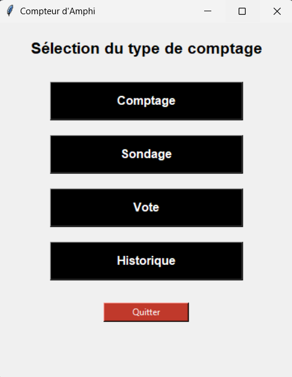
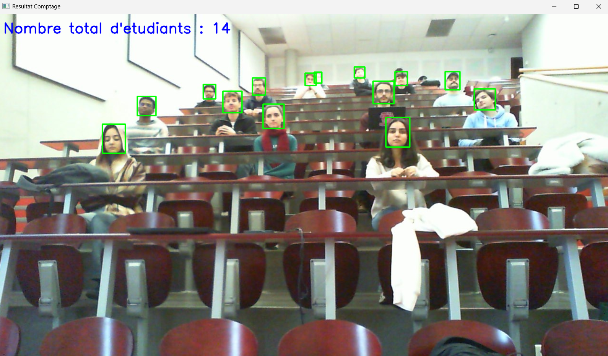
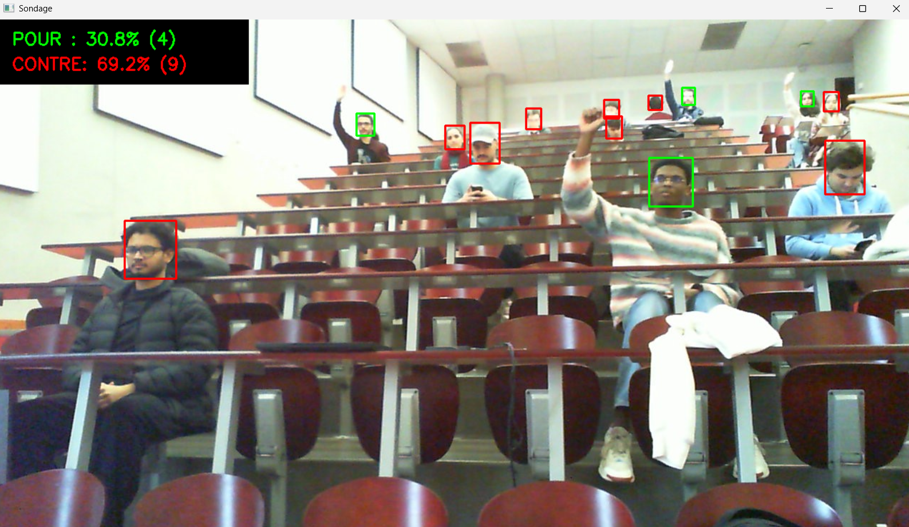
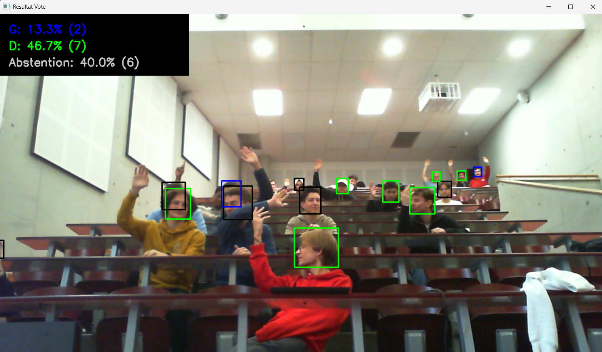

# Groupe 82

# 🎓 Manuel Utilisateur - Compteur d'Amphithéâtre

Bienvenue dans le guide d'utilisation de l'application **Compteur d'Amphithéâtre**.
Cet outil a été conçu pour assister les enseignants (toutes disciplines confondues) dans la gestion de leurs cours en amphithéâtre grâce à l'analyse d'image.

---

## Installation et Lancement

### 1. Préparation
- **Espace disque :** L'application ne nécessite pas d'installation complexe. Cependant, assurez-vous d'avoir environ **1 Go** d'espace libre sur votre ordinateur.
- **Matériel :** Une webcam est nécessaire (intégrée à l'ordinateur portable ou USB externe).

### 2. Démarrage
1. Téléchargez et copiez le dossier **CompteurAmphi** sur votre ordinateur.
2. Branchez votre webcam (si vous en utilisez une externe).
   > *Note : Vous pouvez brancher la webcam avant ou après avoir lancé le programme, l'ordre n'a pas d'importance.*
3. Ouvrez le dossier et double-cliquez sur le fichier **`CompteurAmphi.exe`**.

---

## Interface Principale

Une fois l'application lancée, un menu s'ouvre avec 5 options.


*Menu d'accueil de l'application*

### Comment lancer une analyse ?

Pour les fonctionnalités **Comptage**, **Sondage** et **Vote**, la procédure est toujours la même :

1. Cliquez sur le bouton de la fonctionnalité souhaitée.
2. Une fenêtre vous demandera de choisir la source :
    - **Flux vidéo en direct :** Pour utiliser la webcam.
    - **Importer une image :** Pour analyser une photo déjà enregistrée sur votre ordinateur.
3. **Si vous utilisez la vidéo en direct :** Cadrez l'amphithéâtre, puis appuyez sur la touche **`C`** de votre clavier pour capturer l'image et lancer le calcul.

---

## Les Fonctionnalités en détail

### 1. Comptage 👥
Cette fonction permet de connaître le nombre total de personnes présentes dans le champ de la caméra.
- **Usage :** Idéal pour vérifier le taux de présence.


*Exemple de résultat pour le comptage*

### 2. Sondage ✋
Cette fonction compte le nombre de personnes qui lèvent la main par rapport au nombre total de présents.
- **Usage :** Utile pour poser une question binaire simple (ex: "Qui a fini l'exercice ?").


*Exemple de résultat pour le sondage*

### 3. Vote 🗳️
Cette fonction est plus précise et permet de distinguer les choix selon la main levée :
- **Main Droite :** Vote A.
- **Main Gauche :** Vote B.
- **Pas de main levée :** Abstention.


*Exemple de résultat pour le vote*

---

## Suivi et Fermeture

### Historique 📝
Le bouton **Historique** ouvre automatiquement un fichier texte.
- Ce fichier contient les résultats de tous les comptages, sondages et votes effectués précédemment (avec la date et l'heure).
- N'hésitez pas à modifier le contenu de ce fichier si vous voulez ajouter des détails, comme par exemple la question du sondage. Le fichier `historique.txt` est sauvegardé automatiquement dans le dossier CompteurAmphi.

### Quitter ❌
Pour fermer l'application correctement, cliquez simplement sur le bouton **Quitter**.

---

## Astuces pour une meilleure détection

Pour garantir des résultats précis :
- Assurez-vous que la salle est **suffisamment éclairée**.
- Si possible, placez la caméra un peu **en hauteur** pour bien voir les étudiants du fond.
- Demandez aux étudiants de lever la main **bien haut** lors des votes.
- Demandez aux étudiants de **s'écarter** le plus possible les uns des autres.

---

# ⚙️ Documentation Technique : Compilation et Déploiement

Cette partie du document détaille la procédure technique pour installer l'environnement de développement, gérer les dépendances et compiler l'application **CompteurAmphi** en un exécutable Windows (`.exe`) autonome.

---

## 📂 1. Architecture Requise

Avant toute tentative de compilation, assurez-vous que le dossier du projet respecte strictement cette structure pour que PyInstaller trouve les ressources :

```text
projet/
│
├── menu.py             # Script principal (Point d'entrée)
├── yolo_head_test.pt   # Modèle IA (Têtes)
├── yolov8x-pose-p6.pt  # Modèle IA (Pose)
│
└── detection/          # Package Python (Logique métier)
    ├── __init__.py
    ├── interface.py
    ├── comptage.py
    ├── sondage.py
    └── vote.py

```
---
## 🛠️ 2. Mise en place de l'environnement

### Prérequis
- **OS :** Windows 10/11 (64 bits)
- **Python :** Version 3.10 recommandée.

### Installation étape par étape

1.  **Ouvrir un terminal** à la racine du projet.

2.  **Créer un environnement virtuel (recommandé) :**
    Ceci isole les bibliothèques du projet de votre système global.
    ```powershell
    python -m venv venv
    venv\Scripts\activate
    ```

3.  **Installer les dépendances (Version Optimisée CPU) :**
    Pour éviter que l'exécutable ne pèse 1.5 Go (à cause des pilotes graphiques NVIDIA inutiles ici), nous forçons l'installation de PyTorch en version CPU.
    
    ```powershell
    # 1. Installer PyTorch CPU
    pip install torch torchvision torchaudio --index-url [https://download.pytorch.org/whl/cpu](https://download.pytorch.org/whl/cpu)
    
    # 2. Installer les autres bibliothèques
    pip install ultralytics opencv-python pyinstaller
    ```
4.  **Vérifier l'installation :**
        Lancez cette commande pour confirmer que les bibliothèques principales sont bien détectées :
    ```        
    powershell
    python -c "import torch; import ultralytics; import cv2; print('Succès : Toutes les bibliothèques sont correctement installées !')"
    ```        
---

## 📦 3. Procédure de Compilation (.exe)

Nous utilisons **PyInstaller** pour générer l'exécutable. La commande inclut spécifiquement les données nécessaires (modèles .pt et sous-dossiers).

### La Commande
Exécutez cette commande dans le terminal (environnement virtuel activé) :

```powershell
pyinstaller --noconsole --onedir --name="CompteurAmphi" --collect-all ultralytics --add-data "yolo_head_test.pt;." --add-data "yolov8x-pose-p6.pt;." --add-data "detection;detection" --clean --noconfirm menu.py
```
---

# 🏷️ Documentation Technique : Labélisation du Dataset

Cette partie du document détaille la procédure technique pour créer les **annotations** de notre dataset dans les classes suivantes : *personne, bras gauche, bras droit* au format **YOLO**

---

## Objectif
L’objectif de notre labélisation est de permettre au modèle d’identifier :
- La personne entière
- Le bras gauche
- Le bras droit

Ce découpage permet une détection simple mais efficace de la posture des poignets, sans entrer dans la complexité d’un modèle de pose estimation complet.

---

## Classes utilisées

| ID | Classe |
| :--- | :--- |
| **0** | Bras gauche |
| **1** | Bras droit |
| **2** | Personne |

---

## Détails des annotations

### 1. Personne (classe 2)
**Principe :** La boîte doit englober l’ensemble de la personne visible, de la tête aux pieds.

- **Règles :**
    1. Annoter chaque personne visible dans l’image.
    2. Si une partie est coupée → annoter ce qui est visible.
    3. Ne pas étendre la boîte au-delà du corps.

### 2. Bras gauche (classe 0)
**Principe :** On annote uniquement le poignet gauche anatomique de la personne (pas le bras situé à gauche dans l’image !).

- **Règles :**
    1. La boîte commence à hauteur de l’épaule gauche.
    2. Elle englobe : le poignet.
    3. Annoter même si partiellement visible.
    4. Si impossible de déterminer gauche/droite → ne pas annoter.

### 3. Bras droit (classe 1)
**Principe :** Même logique que pour le bras gauche, mais pour le bras droit anatomique.

- **Règles :**
    1. La boîte englobe uniquement le poignet.
    2. Annoter si la majorité du bras est visible.
    3. Si trop ambigu → ne pas annoter.

---

## Directives générales

### Distinction gauche vs droite
Toujours basée sur le corps de la personne, jamais sur la perspective de la caméra.
- **Indices utiles :** Orientation du torse, Position des jambes, Direction du visage, Accessoires asymétriques (montre, sac...).
- En cas d’ambiguïté totale → ne pas annoter le bras.

### Occlusions
- Un bras est annoté même si très partielle.
- Une personne est annotée même si très partielle.

### Consistance
- Garder des boîtes cohérentes d’une image à l’autre.
- Éviter les boîtes trop larges ou qui englobent de l’arrière-plan inutile.

### Format YOLO
Chaque ligne du fichier .txt d’annotation contient :
`<class_id> <x_center> <y_center> <width> <height>`

Toutes les valeurs sont normalisées entre 0 et 1.

**Exemple :**
*Personne + bras gauche + bras droit*
```text
2 0.50 0.52 0.30 0.70    # Personne
0 0.42 0.55 0.10 0.40    # Bras gauche
1 0.58 0.55 0.10 0.40    # Bras droit
```
 Schéma explicatif (ASCII)
 ```
         ( Personne )
               |
        +----------------+
        |                |
   (Bras gauche)    (Bras droit)
        0                 1

 ```


**Contenu de classes.txt :**

```text
bras_gauche
bras_droit
person
```

*(Les IDs correspondent à l’ordre : 0, 1, 2)*

### Résumé rapide (TL;DR)

- **0** = Poignet gauche
- **1** = Poignet droit
- **2** = Tête

**Règles clés :**
- **On labélise :**
    * La tête → **classe 2**
    * Les poignets → **classes 0 et 1**
- **Orientation :** La distinction gauche/droite est basée sur le **corps**, pas sur l’image.
- **Visibilité :** Poignet annoté même **partiellement**.
- **Doute :** En cas de doute → **ne pas annoter**.

---

# 🧠 Documentation Technique : Fonctionnalités et algorithmes

Cette partie du document détaille la procédure technique pour réaliser les trois fonctionnalités de l'application, à savoir le comptage, le sondage et le vote.

---

## 1. Contexte et Objectifs

Le projet vise à automatiser le comptage d'étudiants et l'analyse de votes (main levée) dans un amphithéâtre. L'environnement présente des contraintes spécifiques : forte densité, occultations (étudiants cachés par les rangées) et petits objets (étudiants au fond de la salle).
L'application répond à 3 fonctionnalités :
    1.	Comptage de présence (Combien de personnes).
    2.	Comptage de mains levées (Interaction globale).
    3.	Vote / Sondage (Distinction Main Gauche / Main Droite / Abstention).


---

## 2. Architecture et Choix des Modèles

Le système repose sur une architecture de Vision par Ordinateur hybride utilisant la bibliothèque **Ultralytics YOLOv8**. Nous combinons deux approches : la Détection d'Objets (Object Detection) et l'Estimation de Pose (Pose Estimation).

### 2.1. Modèle de Détection (Présence)
- **Fichier :** `yolo_head_test.pt`
- **Architecture :** YOLOv8 Detect (Fine-tuned).
- **Classe cible :** `Tête` (Class ID : 0).
- **Justification Technique :** * L'utilisation d'un modèle standard "Personne" (COCO) est inefficace car environ 80% du corps des étudiants est masqué par les tables.
    - La tête est la caractéristique anatomique la plus visible et constante. Un modèle spécialisé réduit drastiquement les faux négatifs dus aux occultations.

### 2.2. Modèle d'Estimation de Pose (Analyse de Vote et de sondage)
- **Fichier :** `yolov8x-pose-p6.pt`
- **Architecture :** YOLOv8-Pose.
- **Caractéristiques :**
    - **Taille X (Extra Large) :** Privilégiée pour maximiser la précision des points clés.
    - **Suffixe P6 :** Modèle optimisé pour les images haute résolution (1280px) et la détection de petits objets. C'est crucial pour détecter les poignets des étudiants situés au fond de l'amphithéâtre.
    - **Points Clés (Key points) utilisés** : Épaules (Indices 5,6), Coudes (7,8), Poignets (9,10).
- **Justification :** La détection d'objet simple ("Box Main") ne permet pas de savoir à qui appartient la main ni de distinguer la gauche de la droite avec certitude. L'estimation de pose reconstruit le squelette, validant la structure anatomique.

---

## 3. Stratégie d'Annotation et critères : 

Pour assurer la maintenance et le ré-entraînement futur des modèles, les critères d'annotation suivants ont été appliqués.

### 3.1. Critères pour la Détection des Têtes

- **Zone d'annotation (Bounding Box)** : Du sommet du crâne jusqu'au menton.

- **Exclusions** :

    - Têtes visibles à moins de 50% (ex: étudiant caché derrière la tête d'un autre).

    - Résolution trop faible (< 15*15 pixels) pour éviter le bruit.

- **Pourquoi pas annoter les mains ?** 
Les mains sont trop mobiles et souvent isolées du corps sur l'image. Annoter les têtes est plus stable pour la fixation spatiale.


### 3.2. Critères pour la Pose
Nous utilisons la topologie standard COCO Keypoints (17 points), filtrée dynamiquement dans le code :
- **Gauche (Left) :** Indices impairs (Épaule 5, Coude 7, Poignet 9).
- **Droite (Right) :** Indices pairs (Épaule 6, Coude 8, Poignet 10).

---

## 4. Analyse Détaillée des Algorithmes
### 4.1. Algorithme de Comptage de Présence
**1ère fonctionnalité :** comptage

Cette fonctionnalité permet à l'utilisateur de choisir sa source (Direct ou Fichier) et visualise les détections en temps réel.

**Etape A** : Acquisition de l'image :

Le système propose deux modes d'entrée via une console :
1.	Mode Capture par Webcam :

- Utilise cv2.VideoCapture(0).

- Affiche un flux vidéo inversé (cv2.flip) pour un effet miroir naturel.

- L'utilisateur appuie sur 'c’pour geler l'image (Capture) qui sera analysée.

2.	Mode Import un Fichier :

- Ouvre une fenêtre de dialogue système via tkinter (filedialog).

- Accepte les formats .jpg, .png.

**Étape B** : Traitement et Inférence
1.	Chargement du Modèle : yolo_head_test.pt.
2.	Inférence : L'image capturée ou chargée est passée au modèle.
3.	Filtrage : On itère sur toutes les boîtes détectées (r.boxes). On ne conserve que la classe CLASS_ID_HEAD = 0.

### 4.2. Algorithme de sondage et de vote (Gauche / Droite):
Algorithme de Vote et Sondage (HandDetector) utilise une logique avancée pour attribuer correctement une main à une personne précise, même dans une foule dense.
**Étape A** : Stratégie de Zoom (Crop)
1.	Détection des têtes sur l'image globale.
2.	Extraction d'une zone (Crop) agrandie verticalement (x6 la hauteur de la tête) pour inclure le buste.
3.	Application du modèle Pose sur ce crop.

**Étape B** : Association stricte par le Nez (Nouveauté v1.4) Pour éviter d'attribuer la main d'un étudiant A à l'étudiant B situé devant lui :
- Le modèle Pose détecte le point clé "Nez" (Keypoint 0).

- Règle : Un squelette (et donc ses mains) n'est associé à une tête que si le nez détecté se trouve physiquement à l'intérieur de la boîte de la tête détectée à l'étape A.

- Si le nez est hors de la boîte, le squelette est ignoré.

**Étape C** : Validation Anatomique ("Smart Check") Une main est validée si :

1.	Hauteur : Poignet au-dessus de l'épaule.
2.	Verticalité : Angle du bras < 75 degrés par rapport à la verticale.
3.	Confiance : 
Si la détection est floue, elle est acceptée uniquement si la somme des confiances (Poignet + Coude) > 1.9.

**Étape D** : Classification du Vote (Par tête) Une fois les mains validées et associées à une tête:

- Si main Gauche détectée uniquement : Vote 'G'.

- Si main Droite détectée uniquement : Vote 'D'.

- Si les deux mains (ou aucune) : Vote 'N ’ (Considéré comme Abstention ou Neutre).

---

## 5. Sorties, Logs et Preuves de Traitement :
Cette section décrit les mécanismes mis en place pour vérifier la validité des comptages et assurer la traçabilité des résultats générés par l'application.

---

### 5.1. Traçabilité Administrative (Logs) :
L'application génère un fichier journal(.txt) pour conserver l'historique des analyses sans avoir à stocker les images lourdes.

- Fichier : historique.txt

- Format : Texte brut, horodaté.

- Exemple de contenu : 25/11/2025 à 14h30, Il y a 52 étudiants

- Utilité : Permet une vérification a posteriori de l'occupation de la salle, vérifier présence.

---

### 5.2. Interface Utilisateur : 
L'application fournit un retour visuel immédiat à l'utilisateur via une surimpression graphique (Overlay) sur l'image source.
 
Les codes couleurs sont spécifiques à chaque fonctionnalité pour éviter toute confusion.

**A. Visualisation du Comptage de Présence**
Utilisée pour vérifier la localisation des étudiants.

- **Boîtes Englobantes (Bounding Boxes)** :
    - Couleur : Verte (0, 255, 0).

    - Rôle : Délimite la zone identifiée comme "Tête". Confirme que le modèle ne détecte pas d'objets inanimés.

- **Étiquette** : Mention "Etudiant" affichée au-dessus de chaque boîte.

- **Compteur Global** : Affichage du total en Bleu (255, 0, 0) en haut à gauche de l'image.

**B. Visualisation du Vote et Sondage** :

  *1.  Mode SONDAGE (Pour / Contre) :*

Ce mode mesure une adhésion. Il ignore visuellement les abstentionnistes pour mettre en évidence les participants actifs.

- VERT (0, 255, 0) : POUR.

    - Déclencheur : Détection d'une seule main levée.

    - ROUGE (0, 0, 255) : CONTRE.

- Déclencheur :soit aucune main levée soit deux mains levées.

    *2.  Mode "VOTE" (G / D / Abstention)*
Ce mode analyse la répartition complète de l'auditoire, incluant les passifs.
- VERT (0, 255, 0) : Vote Droite (D).

    - Déclencheur : Main Droite levée.

- BLEU (255, 0, 0) : Vote Gauche (G).

    - Déclencheur : Main Gauche levée.

- NOIR (0, 0, 0) : Abstention.

    - Déclencheur : Aucune main détectée ou vote invalide (2 mains).

    - Note : Pour la lisibilité du pourcentage "Abstention" sur le bandeau noir en haut de l'image, le texte est affiché en Gris Clair (200, 200, 200).

---

## 6.PROTOCOLE D'ÉVALUATION ET OPTIMISATION :

Afin de justifier scientifiquement les valeurs des paramètres utilisés dans le code, des scripts d'évaluation dédiés ont été développés.

 ### 6.1 Objectif des scripts d'évaluation : 
Ces scripts ne servent pas à l'exécution de l'application, mais à la mesure de sa performance. Ils permettent de comparer les résultats de l'algorithme contre une Dataset annotée.

 ### 6.2 Métriques calculées:
L'évaluation repose sur des indicateurs standards en vision par ordinateur :

- Précision : Le modèle détecte-t-il correctement sans inventer d'objets (Faux Positifs)

- Rappel : Le modèle parvient-il à trouver tous les objets présents dans l'image sans en oublier (Faux Négatifs)

- F1-Score : Moyenne harmonique permettant de juger l'équilibre entre la détection de tous les étudiants et la fiabilité de chaque détection.
---

## 7. SOURCES ET CARACTÉRISTIQUES DES MODÈLES (SOURCES À L'APPUI) :
Cette section détaille l'origine des modèles pour garantir la transparence technique et permettre de retrouver les performances attendues.
  ### 7.1. Framework de Base : Ultralytics YOLOv8 :
Le projet repose entièrement sur le Framework Ultralytics YOLOv8.

- **Source officielle** : GitHub Ultralytics (https://github.com/ultralytics/ultralytics).

- **Papier de référence** : Jocher, G., Chaurasia, A., & Qiu, J. (2023). YOLO by Ultralytics.

- C'est actuellement l'architecture offrant le meilleur compromis Vitesse/Précision et une API Python native facilitant l'intégration hybride (Detect + Pose).

 ### 7.2. Modèle de Détection : yolo_head_test.pt 
Ce modèle est un modèle externe pré-entraîné, récupéré prêt à l'emploi ("Out-of-the-box") pour répondre à la problématique spécifique de l'amphithéâtre.

- **Type** : Modèle communautaire spécialisé (Custom Trained Model).

- **Classe cible** : Tête (Head).

- **Origine technique** : L'utilisation de ce modèle, éprouvé sur des scénarios de foule (CrowdHuman dataset), est une réponse technique aux problèmes de densité. Il surclasse nettement les modèles généralistes lorsqu'il s'agit de distinguer des têtes collées ou partiellement masquées.

- **Avantage du choix** : L'utilisation d'un modèle existant a permis d'économiser la phase coûteuse de constitution de dataset et d'entraînement ou fine-tuning, garantissant une mise en production rapide avec des résultats fiables dès le départ.
  ### 7.3. Modèle d'Estimation de Pose : yolov8x-pose-p6.pt 
Ce modèle est un modèle pré-entraîné officiel fourni par Ultralytics.

- **Source des poids** : Dépôt officiel Ultralytics Assets.

- **Dataset d'origine** : COCO Keypoints (Common Objects in Context). Ce dataset contient plus de 200 000 images annotées avec 17 points clés humains. C'est ce qui garantit que le modèle connait la différence anatomique entre un bras gauche et un bras droit.

- **Spécificité "P6" (High-Res)** :

    - Les modèles standards (P5) ont 3 couches de sortie (stride 8, 16, 32).

    - Le modèle P6 ajoute une 4ème couche (stride 64) et est entraîné en 1280 pixels.

    - Impact Projet : C'est cette caractéristique technique précise qui permet de voir les mains au fond de l'amphi. Sans le P6, les étudiants du fond seraient ignorés.

---

# 📈 Documentation Technique : Scripts d'Évaluation
 
Cette partie du document vise à expliquer la logique d'évaluation et les métriques utilisées par les trois scripts principaux (`evaluer_tête.py`, `evaluer_sondage.py`, `evaluer_vote.py`).

---

## 1. Principes Communs d'Évaluation

Tous les scripts s'appuient sur les principes suivants :

1.  **Dossiers standardisés** : Les résultats sont enregistrés dans le dossier `evaluation/resultats/`. Les prédictions détaillées (format YOLO) sont exportées dans `evaluation/predictions_*/`.
2.  **Métriques de classification** : Les performances sont mesurées à l'aide de la **Précision**, du **Rappel** et du **F1-Score**, calculés à partir des Vrais Positifs (TP), Faux Positifs (FP) et Faux Négatifs (FN).

---

## 2. `evaluer_tête.py` : Évaluation du Comptage (Détection d'Objet)

Ce script évalue la performance du modèle de détection d'objets (YOLO Head) à localiser et compter les personnes.

### Logique et Critères :

- **But** : Mesurer l'exactitude des Bounding Boxes (BB) des têtes.
- **Classe Ciblée (Ground Truth)** : La **Classe `2`** (Têtes) du fichier de labels.
- **Source de Prédiction** : Les BBs de têtes générées par `CompteurAmphi.compter()`.
- **Critère de Matching (TP)** : Utilisation de l'**IoU (Intersection over Union)**.
    * Un match est validé si l'**IoU est supérieur ou égal à 0.5**.
- **Conclusion** : Ce script teste si une personne est physiquement détectée au bon endroit, indépendamment de ses mains.

---

## 3. `evaluer_sondage.py` : Évaluation de la Détection de Mains (Générique)

Ce script évalue la capacité du système à détecter **toute main levée** (classes 0 et 1), sans tenir compte de la classification finale "POUR" ou "CONTRE". Il se concentre sur la **précision spatiale** des keypoints du poignet.

### Logique et Critères :

- **But** : Mesurer la performance de la chaîne de détection de mains (Pose Estimation) en tant que localisateur de poignet.
- **Classes Ciblées (Ground Truth)** : Les **Classes `0` et `1`** (Mains) du fichier de labels.
- **Source de Prédiction** : La liste aplatie de tous les poignets détectés dans `head['hands']`.
- **Localisation** : Le point de référence est le **Poignet** (`p['x'], p['y']`).
- **Critère de Matching (TP)** : Utilisation de la **Distance Euclidienne**.
    * **Seuil Dynamique** : Le rayon de tolérance est adapté à la taille de la personne (`dynamic_threshold = pred['head_h'] * MATCHING_RADIUS_RATIO`). Cela rend l'évaluation juste, car la distance en pixels pour une petite tête (loin) est plus petite.
- **Conclusion** : Ce script teste le Rappel (si toutes les mains sont trouvées) et la Précision de la localisation du keypoint du poignet.

---

## 4. `evaluer_vote.py` : Évaluation de la Classification de Vote (Gauche/Droite)

Ce script est le plus complet. Il évalue si le système détecte correctement une main **et** s'il l'associe au bon côté (Gauche ou Droite).

### Logique et Critères :

- **But** : Mesurer la performance de la **classification de côté** (Gauche vs Droite).
* **Classes Ciblées (Ground Truth)** : Les **Classes `0` (Gauche)** et **`1` (Droite)** du fichier de labels.
- **Source de Prédiction** : Liste aplatie de tous les poignets détectés dans `head['hands']`.
- **Critère de Matching (TP)** : Double vérification nécessaire :
    1.  **Localisation Spatiale** : La Distance Euclidienne doit être inférieure au Seuil Dynamique (`threshold = pred['head_h'] * MATCHING_RADIUS_RATIO`).
    2.  **Validation de Classe** : Le côté prédit (`p['side']`) doit correspondre à la classe GT.
- **Métriques Détaillées** : Les résultats sont ventilés par classe (Gauche vs Droite) pour identifier si le système est plus performant sur un côté que l'autre.

| Script | Cible | Métrique Spatiale | Seuil | Sémantique (G/D) |
| :--- | :--- | :--- | :--- | :--- |
| **`evaluer_tête.py`** | Tête (BB) | IoU | ≥ 0.5 | Non (Classe 2) |
| **`evaluer_sondage.py`** | Main (Poignet) | Distance Euclidienne | Dynamique (`head_h` * 1.0) | Non (Détection pure) |
| **`evaluer_vote.py`** | Main (Poignet) | Distance Euclidienne | Dynamique (`head_h` * 1.0) | **Oui** (Nécessite correspondance G/D) |

---

# 💾 Documentation Technique : Sauvegarde des résultats

Cette partie du document détaille la procédure technique pour mettre en place la **sauvegarde** des résultats des fonctionnalités dans un fichier texte.
---

## 1. Objectif
Le but de cette méthode est de **conserver un historique des résultats** dans un fichier texte. Chaque exécution ajoute une ligne avec la date, l’heure, le nombre d’étudiants et le pourcentage de personnes levant la main.

---

## 2. Étapes détaillées

### 2.1 Vérification et création du fichier
On vérifie si le fichier `historique.txt` existe.
S’il n’existe pas, on le crée vide :

```python
if not os.path.exists(fichier):
    with open(fichier, "w", encoding="utf-8") as f:
        f.write("")
```

### 2.2 Récupération de la date et heure
On attribue une valeur à la variable `date_heure` :

```python
date_heure = datetime.now().strftime("%d/%m/%y à %Hh%M")
```

### 2.3 Préparation de la ligne à écrire
À la variable `ligne`, on affecte la phrase que l'on souhaite écrire dans le fichier texte, en y intégrant les valeurs à enregistrer :

```python
ligne = f"[C]: {date_heure}, Il y a {self.count} étudiants\n"
```

### 2.4 Écrire dans le fichier
On utilise le mode `"a"` (*append*) pour ne pas écraser l'historique :

```python
with open(fichier, "a", encoding="utf-8") as f:
    f.write(ligne)
```
---

## 3. Sondage et vote
On effectue la même chose pour le vote et le sondage : on modifie seulement la phrase à enregistrer et les valeurs écrites.
